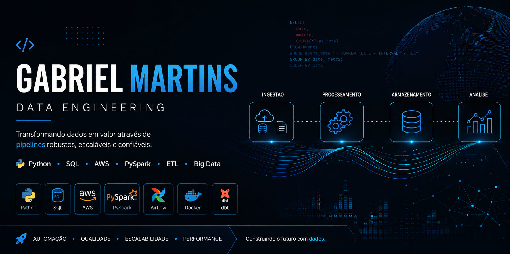

<!-- ========================= -->
<!--           BANNER          -->
<!-- ========================= -->

  

 

<!-- ========================= -->
<!--         SOBRE MIM         -->
<!-- ========================= -->

<h2>👋 Olá, eu sou Gabriel!</h2>

  Sou profissional com experiência em dados, automação e desenvolvimento
  de soluções para análise e engenharia de dados.

  Tenho experiência na construção de soluções de dados, automações,
  processos ETL e desenvolvimento de pipelines, buscando transformar
  dados em informações confiáveis para apoiar decisões de negócio.

---

<!-- ========================= -->
<!--        TECNOLOGIAS        -->
<!-- ========================= -->

<h2>🛠️ Tecnologias</h2>

<h3>💻 Linguagens & Dados</h3>

  
  
  

<h3>☁️ Cloud & Data Engineering</h3>

  
  
  
  

  <strong>AWS:</strong> S3 • Glue • Athena

  <strong>Data Engineering:</strong> ETL • Data Lake • Data Warehouse •
  Medallion Architecture • Data Pipelines

---

<!-- ========================= -->
<!--    PROJETOS EM DESTAQUE   -->
<!-- ========================= -->

<h2>🚀 Projetos em destaque</h2>

<table>
  <tr>
    <td width="50%">

<h3>🌦️ Airflow Weather Data Pipeline</h3>

  Pipeline de dados end-to-end utilizando Python, Airflow, Docker e PostgreSQL
  para ingestão e processamento de dados climáticos provenientes da API OpenWeather.

  <strong>Arquitetura:</strong> 
  API → Bronze → Silver → Gold

  <strong>Tecnologias:</strong> 
  Python • Airflow • Docker • PostgreSQL • ETL

  <a href="https://github.com/gb1martins/airflow-weather-data-pipeline">
    🔗 Ver projeto
  </a>

    </td>

    <td width="50%">

<h3>🏎️ Formula 1 Data Pipeline</h3>

  Pipeline de dados desenvolvido para ingestão e processamento de dados da
  Fórmula 1, utilizando API, Data Lake e arquitetura em camadas.

  <strong>Arquitetura:</strong> 
  API → S3 → Bronze → Silver → Gold

  <strong>Tecnologias:</strong> 
  Python • AWS S3 • AWS Glue • Athena

  <a href="https://github.com/gb1martins/formula_1_pipeline_de_dados">
    🔗 Ver projeto
  </a>

    </td>
  </tr>

  <tr>
    <td width="50%">

<h3>✈️ Airline Data Warehouse</h3>

  Projeto de Data Warehouse utilizando modelagem dimensional para organização
  dos dados e realização de análises de negócio.

  <strong>Tecnologias:</strong> 
  SQL • Python • PostgreSQL • Data Warehouse

  <a href="https://github.com/gb1martins/airline-datawarehouse">
    🔗 Ver projeto
  </a>

    </td>

    <td width="50%">

<h3>🔄 Data Preparation & Transformation</h3>

  Projeto voltado para preparação, transformação e organização de dados,
  aplicando práticas de qualidade e tratamento de dados.

  <strong>Tecnologias:</strong> 
  Python • Pandas • Data Transformation

  <a href="https://github.com/gb1martins/data_prep_transformation">
    🔗 Ver projeto
  </a>

    </td>
  </tr>
</table>

---

<!-- ========================= -->
<!--    ATUALMENTE ESTUDANDO    -->
<!-- ========================= -->

<h2>📚 Atualmente estudando</h2>

  Engenharia de Dados • Cloud Computing • Big Data • Data Pipelines •
  Arquitetura de Dados • AWS

---

<!-- ========================= -->
<!--         OBJETIVO          -->
<!-- ========================= -->

<h2>🎯 Objetivo</h2>

  Construir soluções de dados confiáveis, escaláveis e automatizadas,
  utilizando tecnologia para transformar dados em informações relevantes
  para o negócio.

  Meu foco profissional está direcionado para
  <strong>Engenharia de Dados</strong> e
  <strong>Engenharia de Analytics</strong>.

---

<!-- ========================= -->
<!--          CONTATO          -->
<!-- ========================= -->

<h2>📫 Vamos nos conectar?</h2>

  Estou aberto a conexões e oportunidades relacionadas a
  <strong>Engenharia de Dados</strong> e
  <strong>Engenharia de Analytics</strong>.

  📧
  <a href="mailto:gabrielmartins.augusto@gmail.com">
    gabrielmartins.augusto@gmail.com
  </a>

  💼
  <a href="https://www.linkedin.com/in/gabriel-martins-augusto/">
    LinkedIn
  </a>

 

  <i>Transformando dados em soluções.</i> 🚀

